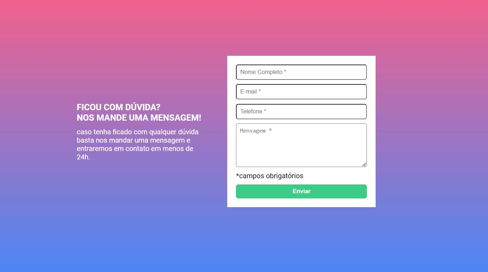

# Desafio Dev-Quest HTML + CSS + JS Intermediário

O desafio foi proposto pelo curso DevQuest durante o módulo de JavaScript intemediário, de criar um formulário de validação.

## Overviwe

### Desafio

Os usuários devem ser capazes de:

- Visualizar o layout ideal para a interface dependendo do tamanho da tela do dispositivo
- Ao clicar para enviar o formulário, caso algum campo não esteja preenchido, dar uma mensagem de erro.

## Desktop Preview

## Mobile Preview

## Técnologias

- HTML
- CSS
- JavaScript
